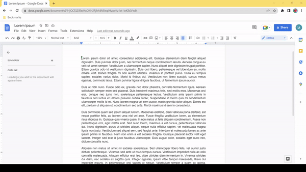

# Format Select (2022/6/21)
- Add-on for Google Docs
  - Apply same format to content in different places without reselecting formats

# Plan
  - User creates and selects formatting rule (and optionally names and saves it)
    - Ex. white font & black highlight
  - Rule is applied to content user selects or types until the user de-selects the rule
    - No need to reselect the rule in order to continue to apply the format
      - Even when editing a new section with different initial formatting
  - (Possible feature in the future: Extract text formatted the same)

## Screenshots
- Before the Add-on:  
  - Applying format by hand:   

### Credits
https://lexi-lambda.github.io/blog/2015/08/22/deploying-racket-applications-on-heroku/  
buildpack: https://github.com/lexi-lambda/heroku-buildpack-racket  
  version: current